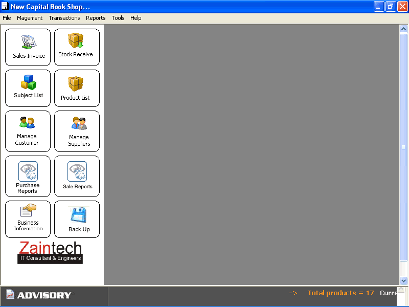



## Book Shop Management System

### Description

This is a complete application that was designed for a Book Shop to manage their

Books inventory and sales etc. This uses the MS Acess database and reports are design

in Crystal Report 8. Sale Invoice with Receipt, Sales Report and Purchase Reports.

Please feel free to give me Feed Back.
 
### More Info
 

             |
---                |---
**Submitted On**   |2006-02-01 18:44:04
**By**             |[Asim\_Shahzad](https://github.com/Planet-Source-Code/PSCIndex/blob/master/ByAuthor/asim-shahzad.md)
**Level**          |Intermediate
**User Rating**    |4.2 (71 globes from 17 users)
**Compatibility**  |VB 3\.0
**Category**       |[Complete Applications](https://github.com/Planet-Source-Code/PSCIndex/blob/master/ByCategory/complete-applications__1-27.md)
**World**          |[Visual Basic](https://github.com/Planet-Source-Code/PSCIndex/blob/master/ByWorld/visual-basic.md)
**Archive File**   |[Book\_Shop\_196991242006\.zip](https://github.com/Planet-Source-Code/asim-shahzad-book-shop-management-system__1-64222/archive/master.zip)

